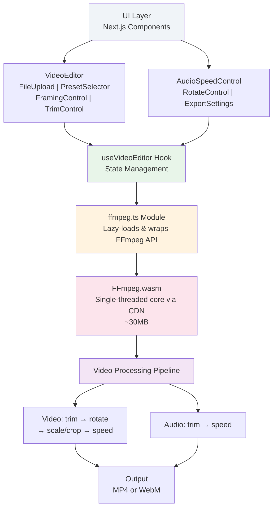

# Reframe

[](https://nextjs.org)
[](https://ffmpegwasm.netlify.app)
[](https://www.typescriptlang.org)
[](LICENSE)

A free, open-source video editor that runs entirely in your browser. No login, no uploads, no ads. Edit videos locally with ease.

## Motivation

I've always enjoyed editing videos. But the existing tools felt bloated, slow, or required accounts and uploads. I wanted something simple, fast, and private. So I built Reframe for myself and my mum, who wanted an easy way to resize videos without understanding file formats or ffmpeg commands. This is a simple tool that helps me do that.

## Features

- **Instant Resizing** — Choose from 11 preset formats (Reels, TikTok, YouTube, Instagram Feed, Panoramic, etc.) or set custom dimensions
- **Flexible Framing** — Fit (letterbox) or Fill (crop) to your target aspect ratio
- **Precise Trimming** — Cut start and end times with real-time duration validation
- **Rotation** — 0°, 90°, 180°, 270° rotation
- **Audio Control** — Keep or mute audio separately
- **Speed Control** — 0.25x to 4x playback speed
- **Quality Settings** — CRF slider for quality vs. file size trade-offs
- **Smooth UX** — Lottie animations, live progress during export, instant download

Everything stays on your device. No servers. No tracking. No login.

---

## Technical Architecture

### System Design

Reframe is a **static single-page application (SPA)** built with Next.js and deployed to any CDN (Vercel, Cloudflare, etc.). It uses ffmpeg.wasm to perform all video processing client-side.



### Key Files

| File                             | Purpose                                                              |
| -------------------------------- | -------------------------------------------------------------------- |
| `src/components/VideoEditor.tsx` | Root component; layout, state orchestration                          |
| `src/hooks/useVideoEditor.ts`    | State management (file, recipe, export status)                       |
| `src/lib/ffmpeg.ts`              | FFmpeg wrapper; lazy-loads WASM, builds filter chains, exports video |
| `src/lib/presets.ts`             | 11 preset definitions (9:16, 16:9, 4:5, etc.)                        |
| `src/lib/types.ts`               | TypeScript types for EditRecipe, ExportResult, etc.                  |
| `src/components/*.tsx`           | Individual control panels (Trim, Rotate, Speed, Quality, etc.)       |

### Data Flow

1. **File Upload** → User selects video → Creates `File` object, probes duration
2. **Recipe Building** → User adjusts settings → `EditRecipe` object updated
3. **Export** → Click Export → Hook loads FFmpeg WASM → Builds filtergraph → Executes ffmpeg → Downloads blob

---

## Design Choices

### Why Client-Side Processing?

- **Privacy**: Videos never uploaded to servers
- **Speed**: No round-trip latency; processing starts immediately
- **Cost**: Zero server infrastructure
- **Reliability**: Works offline; deploy anywhere

### Why Single-Threaded FFmpeg?

FFmpeg.wasm offers two builds:

- **`@ffmpeg/core`** (single-threaded): Works everywhere; no SharedArrayBuffer needed
- **`@ffmpeg/core-mt`** (multi-threaded): Faster but requires COOP/COEP headers

**Decision**: Used single-threaded to maximize deployment flexibility. Static hosts like GitHub Pages and Cloudflare Pages don't allow custom headers. Trade-off: acceptable for typical videos (<30 min); large files may be slow.

### Why Lottie Animations?

**Why not CSS or SVG?**

- Lottie provides smooth, authorship-quality animations out of the box
- Smaller bundle than pre-made SVG frames
- Professional feel with minimal code

**Why imperatively with lottie-web?**

- `lottie-react` has SSR concerns with Next.js App Router
- Direct `lottie-web` API via dynamic import avoids all SSR issues
- Cleaner client-side setup

FFmpeg filters are chained in a specific order for correctness:

1. **Trim** → Remove unwanted frames first (reduces processing load)
2. **Rotate** → Rotate the trimmed video
3. **Scale/Crop** → Resize for target format
4. **Speed** → Adjust playback speed (applied after scaling for accuracy)

For audio:

- **Trim** → Sync with video trim
- **Speed** → Match video speed adjustment
- `atempo` filter only accepts 0.5–2.0x; chain it for extreme speeds (e.g., 0.25x = `atempo=0.5,atempo=0.5`)

### Why No Backend?

I wanted to keep this project simple and deployable anywhere.

---

## Architecture Highlights

### 1. Lazy FFmpeg Loading

FFmpeg.wasm (~30 MB) is downloaded only on first export, not on app load. Uses `toBlobURL` to bypass CORS:

```typescript
coreURL: await toBlobURL(`${CORE_BASE_URL}/ffmpeg-core.js`, "text/javascript");
```

### 2. Video Duration Detection

Probes video duration on file select using `HTMLVideoElement.loadedmetadata` event. Enables real-time trim validation.

### 3. Reactive State Management

Single `EditRecipe` object holds all user settings. Updates via `useCallback` hooks prevent unnecessary re-renders.

---

## Tech Stack

| Layer                | Tech                                                 |
| -------------------- | ---------------------------------------------------- |
| **Framework**        | Next.js 15 (App Router, static export)               |
| **Language**         | TypeScript 5                                         |
| **Styling**          | Tailwind CSS v3, custom theme                        |
| **Icons**            | Lucide React                                         |
| **Animations**       | Lottie Web                                           |
| **Video Processing** | FFmpeg.wasm (single-threaded core)                   |
| **Fonts**            | Bebas Neue (display), Syne (heading), DM Sans (body) |

---

## Getting Started

### Prerequisites

- Node.js 18+
- Bun or npm/yarn

### Installation

```bash
bun install
```

### Development

```bash
bun run dev
```

Open [http://localhost:3000](http://localhost:3000)

### Production Build

```bash
bun run build
```

Outputs a static site to `out/` — deploy to any static host.

---

## How It Works

1. **Load Video**: User selects a file → App detects duration
2. **Build Recipe**: User adjusts presets, framing, trim, speed, etc. → Creates `EditRecipe` object
3. **Export**:
   - Click "EXPORT" → Hook sets status to `loading-engine`
   - FFmpeg WASM lazily downloads from CDN (~30 MB, cached by browser)
   - Hook sets status to `exporting`
   - Video written to WASM virtual filesystem
   - Filtergraph built and executed
   - Output read back as Blob
   - Blob URL created → Download link provided
4. **Download**: User downloads MP4
   All processing happens locally. No data leaves your device.

---

## Contributing

Contributions welcome! Please open an issue or PR.

---

## License

MIT License — See [LICENSE](LICENSE) for details.

---
