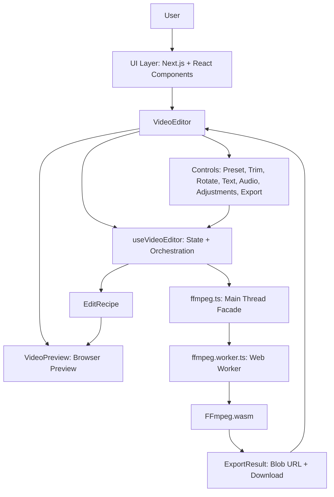
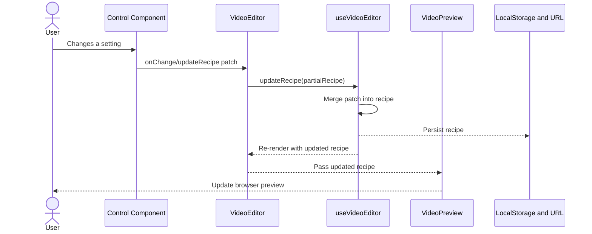
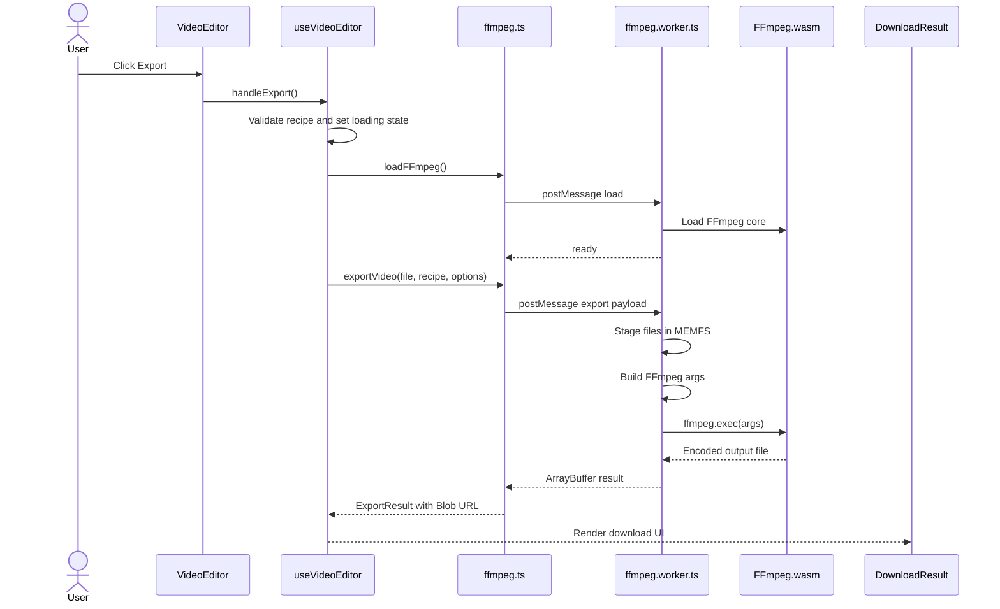

# Reframe Architecture

This document is the source of truth for Reframe's app architecture, state flow, preview behavior, and export pipeline.

---

## Overview

Reframe is a client-side video editor built with Next.js and React. Users upload a local video, adjust an `EditRecipe`, preview changes in the browser, and export the final result with FFmpeg running in a Web Worker. Videos are processed locally on the user's device; no media is uploaded to a server.

The app has three primary layers:

- **UI layer:** React components for layout, preview, controls, overlays, export status, and download results.
- **State layer:** `useVideoEditor` owns the active file, edit recipe, metadata, persistence, and export state.
- **Processing layer:** `ffmpeg.ts` and `ffmpeg.worker.ts` translate the recipe into FFmpeg arguments and run the export in browser-side WebAssembly.

---

## Architecture Diagram



---

## Key Files

| File | Responsibility |
| --- | --- |
| `src/components/VideoEditor.tsx` | Main editor view, layout orchestration, passes state into preview and controls. |
| `src/components/VideoPreview.tsx` | Renders the HTML video element, browser-side previews, playback controls, visual overlays, and comparison preview. |
| `src/hooks/useVideoEditor.ts` | Owns domain state, file validation, recipe updates, persistence, export status, and export orchestration. |
| `src/lib/types.ts` | Shared TypeScript contracts including `EditRecipe`, `ExportResult`, overlay options, and validation helpers. |
| `src/lib/constants.ts` | Default recipe values and shared option constants. |
| `src/lib/ffmpeg.ts` | Main-thread FFmpeg facade, worker lifecycle, request serialization, result handling, and filter builders used by tests. |
| `src/lib/ffmpeg.worker.ts` | Worker-side FFmpeg load, MEMFS staging, argument construction, execution, cleanup, and progress reporting. |
| `src/lib/presets.ts` | Output preset definitions and target dimensions. |
| `src/lib/text-overlay.ts` | FFmpeg text overlay filter generation. |

---

## Component Hierarchy

`VideoEditor` is the main composition root. It renders:

- `ExportOverlay`
- `OnboardingTour`
- `FileUpload`
- `VideoPreview`
- `ThumbnailStrip`
- `PresetSelector`
- `FramingControl`
- `TrimControl`
- `RotateControl`
- `TextControls`
- `AudioSpeedControl`
- brightness, contrast, and saturation controls
- `FormatSelector`
- `ExportSettings`
- `ImageOverlay`
- `DownloadResult`
- `KeyboardShortcutsPanel`

`VideoPreview` contains the actual `<video>` element and preview-only layers:

- playback controls
- framing/crop guide overlay
- grid overlay
- image overlay preview
- draggable text overlays
- optional comparison preview

---

## State Ownership

The central source of truth is the `recipe` object owned by `useVideoEditor`.

`useVideoEditor` owns:

- uploaded `file`
- video metadata and `duration`
- `recipe`
- export state: `status`, `progress`, `result`, `error`
- media refs and seek helpers
- overlay files and overlay options
- persistence to `localStorage`
- URL search parameter synchronization

`VideoEditor` owns local UI-only state:

- opened/closed sections
- selected text overlay ID
- copy-to-clipboard feedback
- scroll behavior after export

`VideoPreview` owns preview-only state:

- loading state
- play/pause state
- current preview time
- mute display state
- framing overlay toggle
- grid overlay toggle
- comparison preview toggle
- measured preview container dimensions
- generated object URL for the image overlay preview

---

## EditRecipe Model

The `EditRecipe` is the declarative edit description used by both preview and export.

Important fields include:

| Field | Meaning |
| --- | --- |
| `preset` | Selected output preset ID. |
| `customWidth`, `customHeight` | Custom output dimensions when `preset === "custom"`. |
| `framing` | `"fit"` for letterboxing/pillarboxing or `"fill"` for crop-to-fill. |
| `trimStart`, `trimEnd` | Trim range in seconds; `trimEnd === null` means through the source end. |
| `rotate` | Rotation in degrees: `0`, `90`, `180`, or `270`. |
| `keepAudio` | Whether original audio is included. |
| `normalizeAudio` | Whether loudness normalization is applied during export. |
| `speed` | Playback speed multiplier. |
| `quality` | Export CRF value. |
| `format` | Output format: `mp4`, `webm`, `mkv`, or `gif`. |
| `brightness` | FFmpeg `eq` brightness value, range `-1..1`, neutral `0`. |
| `contrast` | FFmpeg `eq` contrast value, range `0..2`, neutral `1`. |
| `saturation` | FFmpeg `eq` saturation value, range `0..3`, neutral `1`. |
| `textOverlays` | Text overlays rendered in preview and exported with FFmpeg drawtext filters. |

---

## State Flow

State flows in one direction:



Controls never mutate recipe fields directly. They call `updateRecipe`, and the resulting recipe is passed back down through props.

---

## Browser Preview Architecture

Preview rendering is intentionally browser-side and does not invoke FFmpeg.

Preview constraints:

- No backend rendering.
- No temporary video generation.
- No FFmpeg execution for preview.
- No canvas rendering for simple adjustments.
- The original `URL.createObjectURL(file)` video stream remains the preview source.
- Export behavior stays controlled by the same recipe and FFmpeg pipeline.

### Real-Time Color Adjustment Preview

Brightness, contrast, and saturation are previewed with one consolidated CSS filter chain applied to the existing `<video>` element in `VideoPreview`.

```tsx
const adjustmentFilter = `
  brightness(${1 + recipe.brightness})
  contrast(${recipe.contrast})
  saturate(${recipe.saturation})
`;
```

The mapping exists because the stored values are FFmpeg-oriented:

- FFmpeg brightness neutral is `0`; CSS brightness neutral is `1`, so preview uses `1 + recipe.brightness`.
- Contrast maps directly because both use `1` as neutral.
- Saturation maps directly because both use `1` as neutral.

This keeps the data flow simple:

```text
Adjustment Control
-> updateRecipe
-> EditRecipe
-> VideoPreview
-> CSS filter on existing video element
```

The filter is applied as a style update only. The video element is not remounted or reloaded.

### Rotation Preview

Rotation is previewed with CSS transforms in `VideoPreview`. For `90` and `270` degrees, the preview uses a rotated wrapper so the video remains centered and bounded inside the target aspect ratio.

### Aspect Ratio and Framing Preview

The preview container uses the target preset dimensions to compute its aspect ratio. Framing guides help communicate the difference between:

- **Fit:** scale down to fit target dimensions and fill unused space with bars.
- **Fill:** scale up to cover target dimensions and crop the overflow.

### Trim Preview

`VideoPreview` listens to video time updates and keeps playback inside `trimStart` and `trimEnd`. If playback reaches the trim end, it returns to the trim start and pauses.

### Overlay Preview

Text and image overlays are rendered as DOM layers above the video. Their preview coordinates are scaled to the responsive preview dimensions, while export uses FFmpeg filters against the final output dimensions.

---

## Export Pipeline

Export is separate from preview and is the only time FFmpeg is used.



### Export Steps

1. `VideoEditor` calls `handleExport` from `useVideoEditor`.
2. `handleExport` validates the current recipe and sets export UI state.
3. `loadFFmpeg` initializes the FFmpeg Web Worker and loads the Wasm core.
4. `exportVideo` serializes the video, optional music, and optional image overlay into transferable `ArrayBuffer` payloads.
5. `ffmpeg.worker.ts` writes inputs into FFmpeg MEMFS.
6. Worker-side argument builders translate the recipe into FFmpeg command arguments.
7. FFmpeg runs inside the worker and reports progress.
8. The worker reads the output file from MEMFS and sends it back to the main thread.
9. The main thread wraps the output as a `Blob`, creates a Blob URL, and shows `DownloadResult`.

### Video Filter Order

The export video filter chain is built from the recipe. Conceptually, it applies:

1. trim
2. stabilization, when enabled
3. rotation
4. scale and pad/crop based on preset and framing
5. timestamp normalization when needed
6. speed adjustment
7. denoise, when enabled
8. brightness, contrast, saturation via FFmpeg `eq`
9. text overlays

Color adjustments are exported with:

```text
eq=brightness={recipe.brightness}:contrast={recipe.contrast}:saturation={recipe.saturation}
```

### Audio Filter Order

Audio processing includes:

- optional trim via `atrim`
- timestamp reset via `asetpts`
- speed changes via one or more `atempo` filters
- optional loudness normalization via `loudnorm`
- optional background music mixing

---

## Processing and Threading

FFmpeg work is performed in `ffmpeg.worker.ts`, not on the main UI thread. The main thread facade in `ffmpeg.ts` is responsible for:

- creating and terminating the worker
- resolving readiness and export promises
- forwarding progress callbacks
- serializing files into transferable buffers
- converting final output buffers into Blob URLs

The worker is responsible for:

- loading FFmpeg
- writing files to MEMFS
- building command arguments
- running `ffmpeg.exec`
- reading output files
- cleaning temporary files
- posting progress, result, error, and cancellation messages

---

## Tech Stack

| Layer | Tech |
| --- | --- |
| Framework | Next.js 15 App Router |
| Language | TypeScript |
| UI | React |
| Styling | Tailwind CSS |
| Icons | Lucide React |
| Video Processing | FFmpeg.wasm |
| Execution Isolation | Web Worker |

---

## Design Choices

### Client-Side Processing

All media operations run locally in the browser. This preserves privacy, removes server costs, and allows static deployment.

### Recipe-Driven Editing

The `EditRecipe` is the shared contract between controls, preview, persistence, URL sharing, and export. This avoids duplicate state and keeps preview synchronized with export settings.

### CSS/DOM Preview, FFmpeg Export

Preview uses browser primitives for immediate visual feedback. Export uses FFmpeg for the actual encoded output. This avoids expensive temporary encodes while sliders are changing.

### Worker-Based FFmpeg

FFmpeg runs in a worker to keep the UI responsive. Main-thread React rendering, playback controls, and progress UI remain interactive during export.

### Single Central Hook

`useVideoEditor` acts as the editor facade. It keeps the feature surface understandable without introducing Redux/Zustand for a state model that is still compact enough for a custom hook.

---

## Performance Considerations

Preview performance:

- CSS filters and transforms are generally GPU-accelerated.
- Updating filter style while dragging sliders avoids video reloads and remounts.
- Multiple overlays and filters can increase compositing cost on low-end devices.
- Canvas/WebGL preview should be reserved for future complex effects, not simple adjustment sliders.

Export performance:

- Video files are loaded into memory.
- FFmpeg.wasm also requires working memory during processing.
- Large or high-resolution files can be slow or memory-heavy.
- FFmpeg is lazy-loaded only when export starts.
- Browser/CDN caching reduces repeat load time.

---

## Browser Requirements

Reframe depends on:

- WebAssembly
- Web Workers
- File API
- Blob URLs
- modern JavaScript and CSS features such as `aspect-ratio`, transforms, and filters

Large files may be constrained by device memory, especially on mobile browsers.

---

## Current Boundaries and Known Limitations

- Preview color filters approximate FFmpeg `eq`; they are not guaranteed to be mathematically identical.
- Stabilization and denoise remain export-only because native CSS cannot preview those effects accurately.
- Browser-rendered text can differ slightly from FFmpeg `drawtext` output because font rendering engines differ.
- Responsive overlay positioning must be mapped carefully to final video pixel coordinates.
- FFmpeg export is memory-intensive because source and output media are staged in browser memory.

---

## Future Architecture Improvements

Possible future improvements:

1. More accurate preview pipelines for advanced effects using WebGL/WebGPU.
2. Better custom trim timeline controls.
3. Multi-threaded FFmpeg if deployment can support the required COOP/COEP headers.
4. Chunked or streaming processing to reduce memory pressure.
5. IndexedDB-backed drafts and cached exports.
6. Stronger visual parity tests for overlay placement and text rendering.

---

## Contribution Guidelines for Architecture Changes

When changing core architecture:

1. Keep media processing local to the user's device.
2. Keep `EditRecipe` as the single source of truth for editor settings.
3. Do not invoke FFmpeg for live preview interactions.
4. Keep preview changes lightweight enough for smooth playback.
5. Update this document when changing state flow, preview behavior, or export behavior.
